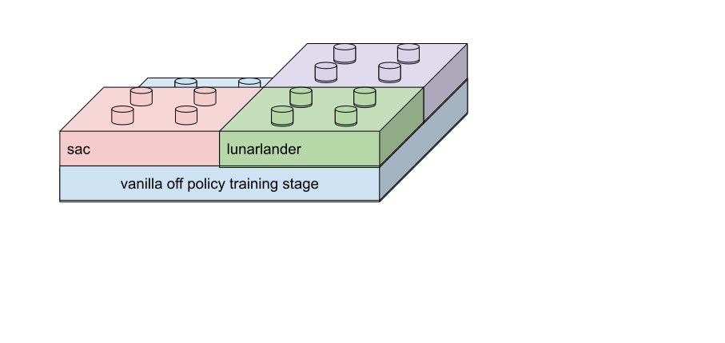

<div id="top"></div>
<!-- from https://github.com/othneildrew/Best-README-Template -->


<!-- PROJECT LOGO -->
<br />
<div align="center">
  <a href="https://github.com/github_username/repo_name">
    
  </a>

<h3 align="center">neighborhood IL</h3>
</div>


<!-- TABLE OF CONTENTS -->
<details>
  <summary>Table of Contents</summary>
  <ol>
    <li>
      <a href="#about-the-project">About The Project</a>
      <ul>
        <li><a href="#built-with">Built With</a></li>
      </ul>
    </li>
    <li>
      <a href="#getting-started">Getting Started</a>
      <ul>
        <li><a href="#prerequisites">Prerequisites</a></li>
        <li><a href="#installation">Installation</a></li>
      </ul>
    </li>
    <li><a href="#usage">Usage</a></li>
    <li><a href="#roadmap">Roadmap</a></li>
    <li><a href="#contributing">Contributing</a></li>
    <li><a href="#license">License</a></li>
    <li><a href="#contact">Contact</a></li>
    <li><a href="#acknowledgments">Acknowledgments</a></li>
  </ol>
</details>


<!-- ABOUT THE PROJECT -->
## About The Project

<!-- [![Product Name Screen Shot][product-screenshot]](https://example.com) -->
This project is built based on RL_Implementation project, which is a RL framework I built. This project aims to design an imitation learning algorithm that can let the agent achieve expert performance with only one demonstration.

<p align="right">(<a href="#top">back to top</a>)</p>


<!-- ### Built With

* [Next.js](https://nextjs.org/)
* [React.js](https://reactjs.org/)
* [Vue.js](https://vuejs.org/)
* [Angular](https://angular.io/)
* [Svelte](https://svelte.dev/)
* [Laravel](https://laravel.com)
* [Bootstrap](https://getbootstrap.com)
* [JQuery](https://jquery.com)

<p align="right">(<a href="#top">back to top</a>)</p> -->

## Architecture explanation
The code is divided into several modules, including `main stage`,`environment`, `RL algorithm`, `replay buffer`, `configuration`
### main stage


This module describes what the code is going to do, for example : off-policy training, on-policy training, collect expert for imitation learning.
### environment


This module is about all kind of manipulation of the RL environemnt like state transformation, wrapping,...
### RL algorithm


All kinds of RL agent are going to be implemented here, imcluding DQN, DDPG, TD3, SAC, PPO,...
### replay buffer


Implements replay buffer like normal replay buffer of prioritized replay buffer.
<!-- ### configuration
Configurations of RL algorithms. -->
<!-- GETTING STARTED -->
<!-- ## Getting Started

This is an example of how you may give instructions on setting up your project locally.
To get a local copy up and running follow these simple example steps. -->

<!-- ### Prerequisites

This is an example of how to list things you need to use the software and how to install them.
* npm
  ```sh
  npm install npm@latest -g
  ``` -->

<!-- ### Installation

1. Get a free API Key at [https://example.com](https://example.com)
2. Clone the repo
   ```sh
   git clone https://github.com/github_username/repo_name.git
   ```
3. Install NPM packages
   ```sh
   npm install
   ```
4. Enter your API in `config.js`
   ```js
   const API_KEY = 'ENTER YOUR API';
   ```

<p align="right">(<a href="#top">back to top</a>)</p> -->


<!-- USAGE EXAMPLES -->
## Usage

use `get_rl_agent`, `get_env`, `get_replay_buffer`, `get_main_stage` function as the interface to access the modules.

```python:
config, config_text = get_config()
env = get_env(config.env, config.wrapper_type)
agent = get_rl_agent(env, config)
storage = get_replay_buffer(env, config)
main_fn = get_main_stage(config)
```

then you can execute your task with the following code

```python:
main_fn.start(agent, env, storage)
```
just like all the blocks are assembled

<p align="right">(<a href="#top">back to top</a>)</p>


## Scripts
### Train normal agent (expert)
```
python3 main.py --main_task sac --env HalfCheetah-v3 --episodes 20000 --batch_size 256
```
### Collect expert data
```
python3 main.py --main_stage collect_expert --main_task sac --env Humanoid-v3 --expert_episode_num 1 --weight_path ./trained_model/sac/Humanoid-v3/episode13425_reward6505.137.pt --save_env_states
```
### Normal neighborhood IL
```
python3 main.py --main_stage neighborhood_il --main_task neighborhood_sac --env <YOUR ENV> --wrapper basic --episode 20000 --data_name <EXPERT DATA PATH> --log_name <NAME OF THIS RUN>
```
ex.
```
python3 main.py --main_stage neighborhood_il --main_task neighborhood_sac --env Ant-v3 --wrapper basic --episode 20000 --data_name sac/episode_num1_8524 --log_name noOOD_threshold10_hardneg_expert8524_targetNeighbor
```
### Run neighborhood IL without BC loss
```
add
--no_bc
```
### Run neighborhood IL without hard negative sampling
```
add
--no_hard_negative_sampling
```


<p align="right">(<a href="#top">back to top</a>)</p>


<!-- CONTRIBUTING -->
<!-- ## Contributing

Contributions are what make the open source community such an amazing place to learn, inspire, and create. Any contributions you make are **greatly appreciated**.

If you have a suggestion that would make this better, please fork the repo and create a pull request. You can also simply open an issue with the tag "enhancement".
Don't forget to give the project a star! Thanks again!

1. Fork the Project
2. Create your Feature Branch (`git checkout -b feature/AmazingFeature`)
3. Commit your Changes (`git commit -m 'Add some AmazingFeature'`)
4. Push to the Branch (`git push origin feature/AmazingFeature`)
5. Open a Pull Request

<p align="right">(<a href="#top">back to top</a>)</p> -->


<!-- LICENSE -->
<!-- ## License

Distributed under the MIT License. See `LICENSE.txt` for more information.

<p align="right">(<a href="#top">back to top</a>)</p> -->


<!-- CONTACT -->
<!-- ## Contact

Your Name - [@twitter_handle](https://twitter.com/twitter_handle) - email@email_client.com

Project Link: [https://github.com/github_username/repo_name](https://github.com/github_username/repo_name)

<p align="right">(<a href="#top">back to top</a>)</p> -->


<!-- ACKNOWLEDGMENTS -->
<!-- ## Acknowledgments

* []()
* []()
* []()

<p align="right">(<a href="#top">back to top</a>)</p> -->


<!-- MARKDOWN LINKS & IMAGES -->
<!-- https://www.markdownguide.org/basic-syntax/#reference-style-links -->
[contributors-shield]: https://img.shields.io/github/contributors/github_username/repo_name.svg?style=for-the-badge
[contributors-url]: https://github.com/github_username/repo_name/graphs/contributors
[forks-shield]: https://img.shields.io/github/forks/github_username/repo_name.svg?style=for-the-badge
[forks-url]: https://github.com/github_username/repo_name/network/members
[stars-shield]: https://img.shields.io/github/stars/github_username/repo_name.svg?style=for-the-badge
[stars-url]: https://github.com/github_username/repo_name/stargazers
[issues-shield]: https://img.shields.io/github/issues/github_username/repo_name.svg?style=for-the-badge
[issues-url]: https://github.com/github_username/repo_name/issues
[license-shield]: https://img.shields.io/github/license/github_username/repo_name.svg?style=for-the-badge
[license-url]: https://github.com/github_username/repo_name/blob/master/LICENSE.txt
[linkedin-shield]: https://img.shields.io/badge/-LinkedIn-black.svg?style=for-the-badge&logo=linkedin&colorB=555
[linkedin-url]: https://linkedin.com/in/linkedin_username
[product-screenshot]: images/screenshot.png
